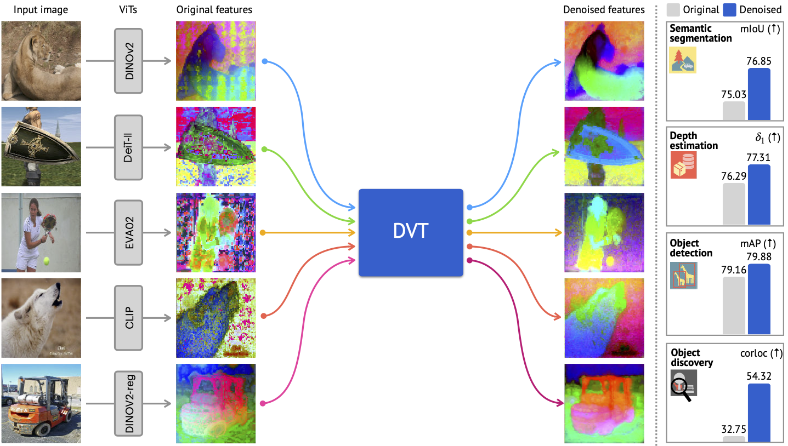
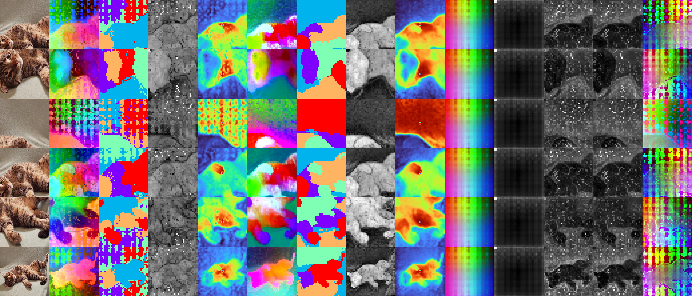

<div align="center">
<h1>Denoising Vision Transformers</h1>

[**Jiawei Yang**](https://jiawei-yang.github.io/)<sup>1&dagger;\*</sup> · [**Katie Z Luo**](https://www.cs.cornell.edu/~katieluo/)<sup>2&dagger;\*</sup> · [**Jiefeng Li**](https://jeffli.site/)<sup>3</sup> · [**Congyue Deng**](https://cs.stanford.edu/~congyue/)<sup>4</sup>
<br>
[**Leonidas Guibas**](https://geometry.stanford.edu/member/guibas/)<sup>4</sup> · [**Dilip Krishnan**](https://dilipkay.wordpress.com/)<sup>5</sup> · [**Kilian Q. Weinberger**](https://www.cs.cornell.edu/~kilian/)<sup>2</sup><br>
[**Yonglong Tian**](https://people.csail.mit.edu/yonglong/)<sup>5</sup> · [**Yue Wang**](https://yuewang.xyz/)<sup>1</sup>

<sup>1</sup>University of Southern California&emsp;&emsp;&emsp;<sup>2</sup>Cornell University
<br>
<sup>3</sup>Shanghai Jiaotong University&emsp;&emsp;&emsp;<sup>4</sup>Stanford University
<br>
<sup>5</sup>Google Research
<br>
&dagger;project lead&emsp;*equal technical contribution contribution

<a href="https://arxiv.org/abs/2401.02957"></a>
<a href='https://jiawei-yang.github.io/DenoisingViT/'></a>
<a href='https://huggingface.co/jjiaweiyang/DVT'></a>
</div>

<div align="center">
  <h2 style="color:#FF6347;"><strong>📢 ECCV 2024 Oral 📢</strong></h2>
</div>

This work presents **Denoising Vision Transformers (DVT)**. It removes the visually annoying artifacts commonly seen in ViTs' feature maps and improves the downstream performance of dense recognition tasks.



## News

- **2024-10-28:** Code and Models are updated!
- **2024-07-01:** DVT is accepted to ECCV 2024 as an **Oral** presentation!

### Citation

```
@inproceedings{yang2024dvt,
  author = {Yang, Jiawei and Luo, Katie Z and Li, Jiefeng and Deng, Congyue and Guibas, Leonidas J. and Krishnan, Dilip and Weinberger, Kilian Q and Tian, Yonglong and Wang, Yue},
  title = {DVT: Denoising Vision Transformers},
  journal = {ECCV},
  year = {2024},
}
```

-----------------
*This README file and codebase are legacy. We will update them soon.*

## Usage

### Environment Setup

#### Per-Image Denoising and Denoiser Training

```bash
git clone https://github.com/Jiawei-Yang/Denoising-ViT.git
cd Denoising-ViT
conda create -n dvt python=3.10 -y
conda activate dvt
pip install -r requirements.txt

# Install `tiny-cuda-nn` manually:
pip install git+https://github.com/NVlabs/tiny-cuda-nn/#subdirectory=bindings/torch

```

If you want a single conda environment for different GPU architectures, install `tiny-cuda-nn` with a pre-defined architecture list:

```bash
# 7.0 for V100, 8.0 for A100, 8.6 for A40 or A6000
TORCH_CUDA_ARCH_LIST="7.0 8.0 8.6" pip install git+https://github.com/NVlabs/tiny-cuda-nn/#subdirectory=bindings/torch
```

If you encounter the `error: parameter packs not expanded with ‘...’`, Refer to [this solution](https://github.com/NVlabs/instant-ngp/issues/119#issuecomment-1034701258) on GitHub.

#### Evaluation Environment

This section explains how to evaluate the denoised features on downstream tasks.
We use `mmsegmentation` for dense prediction task evaluations on the VOC, ADE20k, and NYU-Depth datasets.
If you don’t plan to evaluate on these tasks, you can skip this part.

Please note that `mmsegmentation` have some dependencies that may conflict with the dependencies in the main environment.
To avoid this, we temporarily downgrade the CUDA and PyTorch versions to 11.7 for installation.

```bash
conda create -n dvt_eval python=3.10 -y
conda activate dvt_eval

# Install CUDA 11.7 or soft link CUDA 11.7 to /usr/local/cuda-11.7
CUDA_VERSION=11.7
export PATH=/usr/local/cuda-${CUDA_VERSION}/bin:$PATH
export LD_LIBRARY_PATH=/usr/local/cuda-${CUDA_VERSION}/lib64:$LD_LIBRARY_PATH
export CUDA_HOME=/usr/local/cuda-${CUDA_VERSION}

# Full uninstallation
pip install -r requirements_eval.txt
pip uninstall mmcv-full -y && pip uninstall mmcv -y && pip cache purge

# Force CUDA installation
MCV_WITH_OPS=1 FORCE_CUDA=1 pip install mmcv-full==1.5.0 mmsegmentation==0.27.0
```

### Pre-trained Models and Video Generation

Please refer to [huggingface](https://huggingface.co/jjiaweiyang/DVT) for the pre-trained models.

To generate demo videos similar to those in our website, you can simply run `python make_video_demo.py`

### Data preparation

Our data folder should look like this:

```
data
├── ADEChallengeData2016
├── nyu
├── VOCdevkit
├── imagenet
└── voc_train.txt
```

1. PASCAL-VOC 2007 and 2012:
Please download the PASCAL VOC07 and PASCAL VOC12 datasets ([link](http://host.robots.ox.ac.uk/pascal/VOC/)) and put the data in the folder `data`, e.g.,

In our experiments reported in the paper, we used the first 10,000 examples from `data/voc_train.txt` for stage-1 denoising. This text file was generated by gathering all JPG images from `data/VOC2007/JPEGImages` and `data/VOC2012/JPEGImages`, excluding the validation images.

2. ADE20K:
Please download the [ADE20K dataset](PLACEHOLDER) and put the data in  `data/ADEChallengeData2016`.

3. NYU-D:
Please download the [NYU-depth dataset](PLACEHOLDER) and put the data in  `data/nyu`. Results are provided given the 2014 annotations following previous works.

4. ImageNet (Optional):

- Download the ImageNet dataset from <http://www.image-net.org/>
- Extract data following the instructions at [here](https://gist.github.com/BIGBALLON/8a71d225eff18d88e469e6ea9b39cef4).
- Put the data in `data/imagenet`.

### Run the code

See `sample_scripts` for examples of running the code.

We provide some demo outputs in demo/demo_outputs. For example, this image shows our denoising results on a cat image:

From left to right, we show: (1) input crop, (2) raw DINOv2 base output, (3) Kmeans clustering of the raw output, (4) L2 feature norm of the raw output, (5) the similarity between the central patch and other patches in the raw output, (6) our denoised output, (7) Kmeans clustering of the denoised output, (8) L2 feature norm of the denoised output, (9) the similarity between the central patch and other patches in the denoised output, (10) the decomposed shared artifacts, (11) the L2 norm of the shared artifacts, (12) the ground-truth residual error, (13) the predicted residual term, and (13) the composition of the shared artifacts and the predicted residual term.

## Results and Pre-trained Models

Please refer to [huggingface](https://huggingface.co/jjiaweiyang/DVT) for the pre-trained models.

### Model Summary

We include 4 versions of models in this release:

- `voc_denoised`: These are single-layer Transformer models that are trained to denoise the output of the original ViT models. These models are trained on the VOC dataset.
- `voc_distilled`: These are models distilled from the denoiser using the ImageNet-1k dataset, where all model parameters are jointly fine-tuned. The distillation process involves three stages:
    1. Stage 1: Perform per-image denoising on the VOC datasets.
    2. Stage 2: Train the denoiser using the features obtained from the per-image denoising in Stage 1 on the VOC datasets.
    3. Stage 3: Fine-tune the entire model on the ImageNet-1k dataset, using the outputs from the Stage 2 denoiser as supervision.
- `imgnet_denoised`: The same as `voc_denoised`, but trained on the ImageNet-1k dataset.
- `imgnet_distilled`: The same as `voc_distilled`, but trained on the ImageNet-1k dataset, including the denoiser and the distilled model.

### Performance Summary

- Baseline: The original ViT models.

| Model                                                        | VOC_mIoU | VOC_mAcc | ADE_mIoU | ADE_mAcc | NYU_RMSE | NYU_abs_rel | NYU_a1  |
|--------------------------------------------------------------|----------|----------|----------|----------|-----------|-------------|---------|
| vit_small_patch14_dinov2.lvd142m                             | 81.78    | 88.44    | 44.05    | 55.53    | 0.4340    | 0.1331      | 84.49%  |
| vit_base_patch14_dinov2.lvd142m                              | 83.52    | 90.60    | 47.02    | 58.45    | 0.3965    | 0.1197      | 87.59%  |
| vit_large_patch14_dinov2.lvd142m                             | 83.43    | 90.38    | 47.53    | 59.64    | 0.3831    | 0.1145      | 88.89%  |
| vit_small_patch14_reg4_dinov2.lvd142m                        | 80.88    | 88.69    | 44.36    | 55.90    | 0.4328    | 0.1303      | 85.00%  |
| vit_base_patch14_reg4_dinov2.lvd142m                         | 83.48    | 90.95    | 47.73    | 60.17    | 0.3967    | 0.1177      | 87.92%  |
| vit_large_patch14_reg4_dinov2.lvd142m                        | 83.21    | 90.67    | 48.44    | 61.28    | 0.3852    | 0.1139      | 88.53%  |
| deit3_base_patch16_224.fb_in1k                               | 71.03    | 80.67    | 32.84    | 42.79    | 0.5837    | 0.1772      | 73.03%  |
| vit_base_patch16_clip_384.laion2b_ft_in12k_in1k              | 77.75    | 86.68    | 40.50    | 52.81    | 0.5585    | 0.1678      | 74.30%  |
| vit_base_patch16_224.dino                                    | 62.92    | 75.98    | 31.03    | 40.62    | 0.5742    | 0.1694      | 74.55%  |
| vit_base_patch16_224.mae                                     | 50.29    | 63.10    | 23.84    | 32.06    | 0.6629    | 0.2275      | 66.24%  |
| eva02_base_patch16_clip_224.merged2b                         | 71.49    | 82.69    | 37.89    | 50.31    | -    | -      | -   |
| vit_base_patch16_384.augreg_in21k_ft_in1k                    | 73.51    | 83.60    | 36.46    | 48.65    | 0.6360    | 0.1898      | 69.10%  |

- DVT (voc_denoised): The denoised models trained on the VOC dataset.

| Model                                                        | VOC_mIoU | VOC_mAcc | ADE_mIoU | ADE_mAcc | NYU_RMSE | NYU_abs_rel | NYU_a1  |
|--------------------------------------------------------------|----------|----------|----------|----------|-----------|-------------|---------|
| vit_small_patch14_dinov2.lvd142m                             | 82.78    | 90.69    | 45.14    | 56.35    | 0.4368    | 0.1337      | 84.34%  |
| vit_base_patch14_dinov2.lvd142m                              | 84.92    | 91.74    | 48.54    | 60.21    | 0.3811    | 0.1166      | 88.42%  |
| vit_large_patch14_dinov2.lvd142m                             | 85.25    | 91.69    | 49.80    | 61.98    | 0.3826    | 0.1118      | 89.32%  |
| vit_small_patch14_reg4_dinov2.lvd142m                        | 81.93    | 89.54    | 45.55    | 57.52    | 0.4251    | 0.1292      | 85.01%  |
| vit_base_patch14_reg4_dinov2.lvd142m                         | 84.58    | 91.17    | 49.24    | 61.66    | 0.3898    | 0.1146      | 88.60%  |
| vit_large_patch14_reg4_dinov2.lvd142m                        | 84.37    | 91.42    | 49.19    | 62.21    | 0.3852    | 0.1141      | 88.45%  |
| deit3_base_patch16_224.fb_in1k                               | 73.52    | 83.65    | 33.57    | 43.56    | 0.5817    | 0.1774      | 73.05%  |
| vit_base_patch16_clip_384.laion2b_ft_in12k_in1k              | 79.50    | 88.43    | 41.33    | 53.54    | 0.5512    | 0.1639      | 75.30%  |
| vit_base_patch16_224.dino                                    | 66.41    | 77.75    | 32.45    | 42.42    | 0.5784    | 0.1738      | 73.75%  |
| vit_base_patch16_224.mae                                     | 50.65    | 62.90    | 23.25    | 31.03    | 0.6651    | 0.2271      | 65.44%  |
| eva02_base_patch16_clip_224.merged2b                         | 73.76    | 84.50    | 37.99    | 50.40    | 0.6196    | 0.1904      | 69.86%  |
| vit_base_patch16_384.augreg_in21k_ft_in1k                    | 74.82    | 84.40    | 36.75    | 48.82    | 0.6316    | 0.1921      | 69.37%  |

- DVT (voc_distilled): The distilled models trained on the VOC dataset.

| Model                                                        | VOC_mIoU | VOC_mAcc | ADE_mIoU | ADE_mAcc | NYU_RMSE | NYU_abs_rel | NYU_a1  |
|--------------------------------------------------------------|----------|----------|----------|----------|-----------|-------------|---------|
| vit_base_patch14_dinov2.lvd142m                              | 85.10    | 91.41    | 48.57    | 60.35    | 0.3850    | 0.1207      | 88.25%  |
| vit_base_patch14_reg4_dinov2.lvd142m                         | 84.36    | 90.80    | 49.20    | 61.56    | 0.3838    | 0.1143      | 88.97%  |
| deit3_base_patch16_224.fb_in1k                               | 73.63    | 82.74    | 34.43    | 44.96    | 0.5712    | 0.1747      | 74.00%  |
| vit_base_patch16_clip_384.laion2b_ft_in12k_in1k              | 79.86    | 88.33    | 42.28    | 54.26    | 0.5253    | 0.1571      | 77.23%  |
| vit_base_patch16_224.dino                                    | 66.80    | 78.47    | 32.68    | 42.58    | 0.5750    | 0.1696      | 73.86%  |
| vit_base_patch16_224.mae                                     | 51.91    | 64.67    | 23.73    | 31.88    | 0.6733    | 0.2282      | 65.33%  |
| eva02_base_patch16_clip_224.merged2b                         | 75.93    | 85.44    | 40.15    | 52.04    | -    | -      | -   |
| vit_base_patch16_384.augreg_in21k_ft_in1k                    | 76.26    | 85.14    | 38.62    | 50.61    | 0.5825    | 0.1768      | 73.14%  |

- DVT (imgnet_denoised) and DVT (imgnet_distilled): The denoised and distilled models trained on the ImageNet-1k dataset.

| Model                                                        | VOC_mIoU | VOC_mAcc | ADE_mIoU | ADE_mAcc | NYU_RMSE | NYU_abs_rel | NYU_a1  |
|--------------------------------------------------------------|----------|----------|----------|----------|-----------|-------------|---------|
| vit_base_patch14_dinov2.lvd142m (denoised)                   | 85.17    | 91.55    | 48.68    | 60.60    | 0.3832    | 0.1152      | 88.50%  |
| vit_base_patch14_dinov2.lvd142m (distilled)                  | 85.33    | 91.48    | 48.85    | 60.47    | 0.3704    | 0.1115      | 89.74%  |

A summary of DINOv2-base model is shown below:

| vit_base_patch14_dinov2.lvd142m                              | VOC_mIoU | VOC_mAcc | ADE_mIoU | ADE_mAcc | NYU_RMSE | NYU_abs_rel | NYU_a1  |
|--------------------------------------------------------------|----------|----------|----------|----------|-----------|-------------|---------|
| baseline                                                     | 83.52    | 90.60    | 47.02    | 58.45    | 0.3965    | 0.1197      | 87.59%  |
| `voc_denoised`                                               | 84.92    | 91.74    | 48.54    | 60.21    | 0.3811    | 0.1166      | 88.42%  |
| `voc_distilled`                                              | 85.10    | 91.41    | 48.57    | 60.35    | 0.3850    | 0.1207      | 88.25%  |
| `imgnet_denoised`                                            | 85.17    | 91.55    | 48.68    | 60.60    | 0.3832    | 0.1152      | 88.50%  |
| `imgnet_distilled`                                           | 85.33    | 91.48    | 48.85    | 60.47    | 0.3704    | 0.1115      | 89.74%  |

In fact, during our exploration, we find the setting of denoiser training and distillation training can slightly affect the performance of the final model. For example, whether to include the `cls` token in the denoiser's Transformer feedforward layer can affect the depth estimation performance. Our best model during the exploration achieves around 85.56 mIoU on the VOC, 49.02 mIoU on the ADE, and 89.98% a1 on the NYU datasets.

However, we do not include this model in the final release because of the additional complexity but non-significant improvement.

### Legacy Results

These are old results. We keep them here for reference.

#### VOC Evaluation Results

|                   |  mIoU |  aAcc |  mAcc | Logfile |
|-------------------|:-----:|:-----:|:-----:|:-------:|
| MAE               | 50.24 | 88.02 | 63.15 |[log](https://jiawei-yang.github.io/DenoisingViT/logs/baselines/vit_base_patch16_224.mae_voc.log)|
| MAE + DVT         | 50.53 | 88.06 | 63.29 |[log](https://jiawei-yang.github.io/DenoisingViT/logs/dvt/vit_base_patch16_224.mae_voc.log)|
| DINO              | 63.00 | 91.38 | 76.35 |[log](https://jiawei-yang.github.io/DenoisingViT/logs/baselines/vit_base_patch16_224.dino_voc.log)|
| DINO + DVT        | 66.22 | 92.41 | 78.14 |[log](https://jiawei-yang.github.io/DenoisingViT/logs/dvt/vit_base_patch16_224.dino_voc.log)|
| Registers         | 83.64 | 96.31 | 90.67 |[log](https://jiawei-yang.github.io/DenoisingViT/logs/baselines/vit_base_patch14_reg4_dinov2.lvd142m_voc.log)|
| Registers + DVT   | 84.50 | 96.56 | 91.45 |[log](https://jiawei-yang.github.io/DenoisingViT/logs/dvt/vit_base_patch14_reg4_dinov2.lvd142m_voc.log)|
| DeiT3             | 70.62 | 92.69 | 81.23 |[log](https://jiawei-yang.github.io/DenoisingViT/logs/baselines/deit3_base_patch16_224.fb_in1k_voc.log)|
| DeiT3 + DVT       | 73.36 | 93.34 | 83.74 |[log](https://jiawei-yang.github.io/DenoisingViT/logs/dvt/deit3_base_patch16_224.fb_in1k_voc.log)|
| EVA               | 71.52 | 92.76 | 82.95 |[log](https://jiawei-yang.github.io/DenoisingViT/logs/baselines/eva02_base_patch16_clip_224.merged2b_voc.log)|
| EVA + DVT         | 73.15 | 93.43 | 83.55 |[log](https://jiawei-yang.github.io/DenoisingViT/logs/dvt/eva02_base_patch16_clip_224.merged2b_voc.log)|
| CLIP              | 77.78 | 94.74 | 86.57 |[log](https://jiawei-yang.github.io/DenoisingViT/logs/baselines/vit_base_patch16_clip_384.laion2b_ft_in12k_in1k_voc.log)|
| CLIP + DVT        | 79.01 | 95.13 | 87.48 |[log](https://jiawei-yang.github.io/DenoisingViT/logs/dvt/vit_base_patch16_clip_384.laion2b_ft_in12k_in1k_voc.log)|
| DINOv2            | 83.60 | 96.30 | 90.82 |[log](https://jiawei-yang.github.io/DenoisingViT/logs/baselines/vit_base_patch14_dinov2.lvd142m_voc.log)|
| DINOv2 + DVT      | 84.84 | 96.67 | 91.70 |[log](https://jiawei-yang.github.io/DenoisingViT/logs/dvt/vit_base_patch14_dinov2.lvd142m_voc.log)|

#### ADE20K Evaluation Results

|                   |  mIoU |  aAcc |  mAcc | Logfile |
|-------------------|:-----:|:-----:|:-----:|:-------:|
| MAE               | 23.60 | 68.54 | 31.49 |[log](https://jiawei-yang.github.io/DenoisingViT/logs/baselines/vit_base_patch16_224.mae_ade20k.log)|
| MAE + DVT         | 23.62 | 68.58 | 31.25 |[log](https://jiawei-yang.github.io/DenoisingViT/logs/dvt/vit_base_patch16_224.mae_ade20k.log)|
| DINO              | 31.03 | 73.56 | 40.33 |[log](https://jiawei-yang.github.io/DenoisingViT/logs/baselines/vit_base_patch16_224.dino_ade20k.log)|
| DINO + DVT        | 32.40 | 74.53 | 42.01 |[log](https://jiawei-yang.github.io/DenoisingViT/logs/dvt/vit_base_patch16_224.dino_ade20k.log)|
| Registers         | 48.22 | 81.11 | 60.52 |[log](https://jiawei-yang.github.io/DenoisingViT/logs/baselines/vit_base_patch14_reg4_dinov2.lvd142m_ade20k.log)|
| Registers + DVT   | 49.34 | 81.94 | 61.70 |[log](https://jiawei-yang.github.io/DenoisingViT/logs/dvt/vit_base_patch14_reg4_dinov2.lvd142m_ade20k.log)|
| DeiT3             | 32.73 | 72.61 | 42.81 |[log](https://jiawei-yang.github.io/DenoisingViT/logs/baselines/deit3_base_patch16_224.fb_in1k_ade20k.log)|
| DeiT3 + DVT       | 36.57 | 74.44 | 49.01 |[log](https://jiawei-yang.github.io/DenoisingViT/logs/dvt/deit3_base_patch16_224.fb_in1k_ade20k.log)|
| EVA               | 37.45 | 72.78 | 49.74 |[log](https://jiawei-yang.github.io/DenoisingViT/logs/baselines/eva02_base_patch16_clip_224.merged2b_ade20k.log)|
| EVA + DVT         | 37.87 | 75.02 | 49.81 |[log](https://jiawei-yang.github.io/DenoisingViT/logs/dvt/eva02_base_patch16_clip_224.merged2b_ade20k.log)|
| CLIP              | 40.51 | 76.44 | 52.47 |[log](https://jiawei-yang.github.io/DenoisingViT/logs/baselines/vit_base_patch16_clip_384.laion2b_ft_in12k_in1k_ade20k.log)|
| CLIP + DVT        | 41.10 | 77.41 | 53.07 |[log](https://jiawei-yang.github.io/DenoisingViT/logs/dvt/vit_base_patch16_clip_384.laion2b_ft_in12k_in1k_ade20k.log)|
| DINOv2            | 47.29 | 80.84 | 59.18 |[log](https://jiawei-yang.github.io/DenoisingViT/logs/baselines/vit_base_patch14_dinov2.lvd142m_ade20k.log)|
| DINOv2 + DVT      | 48.66 | 81.89 | 60.24 |[log](https://jiawei-yang.github.io/DenoisingViT/logs/dvt/vit_base_patch14_dinov2.lvd142m_ade20k.log)|

#### NYU-D Evaluation Results

|                   |  RMSE  |  Rel   | Logfile |
|-------------------|:------:|:------:|:---:|
| MAE               | 0.6695 | 0.2334 | [log](https://jiawei-yang.github.io/DenoisingViT/logs/baselines/vit_base_patch16_224.mae_nyu.log)|
| MAE + DVT         | 0.7080 | 0.2560 | [log](https://jiawei-yang.github.io/DenoisingViT/logs/dvt/vit_base_patch16_224.mae_nyu.log)|
| DINO              | 0.5832 | 0.1701 | [log](https://jiawei-yang.github.io/DenoisingViT/logs/baselines/vit_base_patch16_224.dino_nyu.log)|
| DINO + DVT        | 0.5780 | 0.1731 | [log](https://jiawei-yang.github.io/DenoisingViT/logs/dvt/vit_base_patch16_224.dino_nyu.log)|
| Registers         | 0.3969 | 0.1190 | [log](https://jiawei-yang.github.io/DenoisingViT/logs/baselines/vit_base_patch14_reg4_dinov2.lvd142m_nyu.log)|
| Registers + DVT   | 0.3880 | 0.1157 | [log](https://jiawei-yang.github.io/DenoisingViT/logs/dvt/vit_base_patch14_reg4_dinov2.lvd142m_nyu.log)|
| DeiT3             |  0.588 | 0.1788 | [log](https://jiawei-yang.github.io/DenoisingViT/logs/baselines/deit3_base_patch16_224.fb_in1k_nyu.log)|
| DeiT3 + DVT       | 0.5891 | 0.1802 | [log](https://jiawei-yang.github.io/DenoisingViT/logs/dvt/deit3_base_patch16_224.fb_in1k_nyu.log)|
| EVA               | 0.6446 | 0.1989 | [log](https://jiawei-yang.github.io/DenoisingViT/logs/baselines/eva02_base_patch16_clip_224.merged2b_nyu.log)|
| EVA + DVT         | 0.6243 | 0.1964 | [log](https://jiawei-yang.github.io/DenoisingViT/logs/dvt/eva02_base_patch16_clip_224.merged2b_nyu.log)|
| CLIP              | 0.5598 | 0.1679 | [log](https://jiawei-yang.github.io/DenoisingViT/logs/baselines/vit_base_patch16_clip_384.laion2b_ft_in12k_in1k_nyu.log)|
| CLIP + DVT        | 0.5591 | 0.1667 | [log](https://jiawei-yang.github.io/DenoisingViT/logs/dvt/vit_base_patch16_clip_384.laion2b_ft_in12k_in1k_nyu.log)|
| DINOv2            | 0.4034 | 0.1238 | [log](https://jiawei-yang.github.io/DenoisingViT/logs/baselines/vit_base_patch14_dinov2.lvd142m_nyu.log)|
| DINOv2 + DVT      | 0.3943 | 0.1200 | [log](https://jiawei-yang.github.io/DenoisingViT/logs/dvt/vit_base_patch14_dinov2.lvd142m_nyu.log)|
